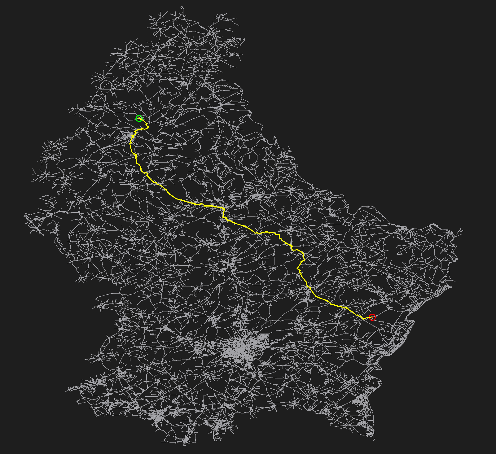

# Luxembourg Map Visualizer with Dijkstra's Algorithm

This **Qt C++** application allows users to visualize a **map of Luxembourg** and compute the **shortest path** between two selected locations using **Dijkstra's Algorithm**.

## Features

- **Interactive Map Visualization**
  - Displays a **graph representation** of Luxembourg's map.
  - Nodes represent locations, and edges represent road connections with distances.

- **Shortest Path Calculation**
  - Users can **click two locations** (start & destination).
  - The **shortest path** is computed using **Dijkstra's Algorithm** and displayed.
  - The path is visually highlighted on the map.

- **Dynamic Scaling**
  - The map is **scaled** to fit the screen.
  - Supports **resizing** without losing clarity.

## Prerequisites

- **Qt Creator installed**

